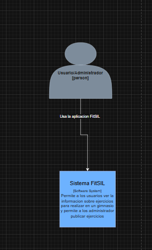
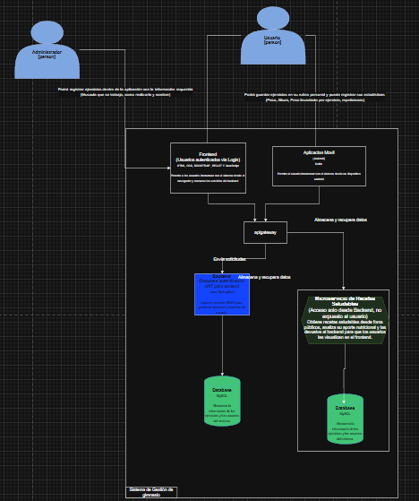
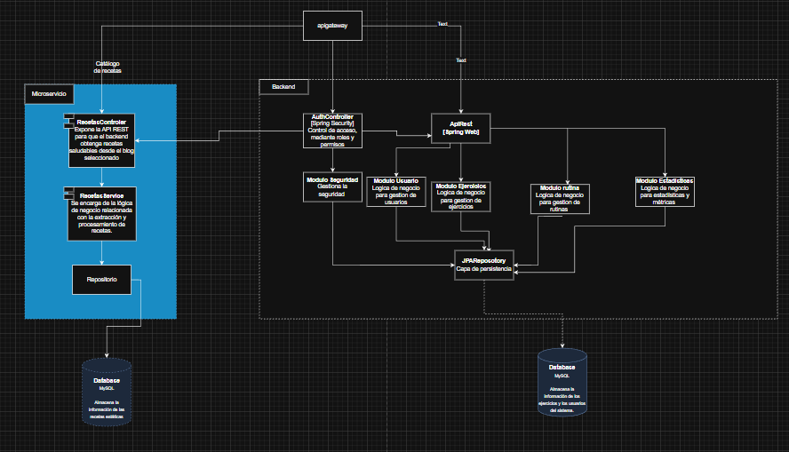
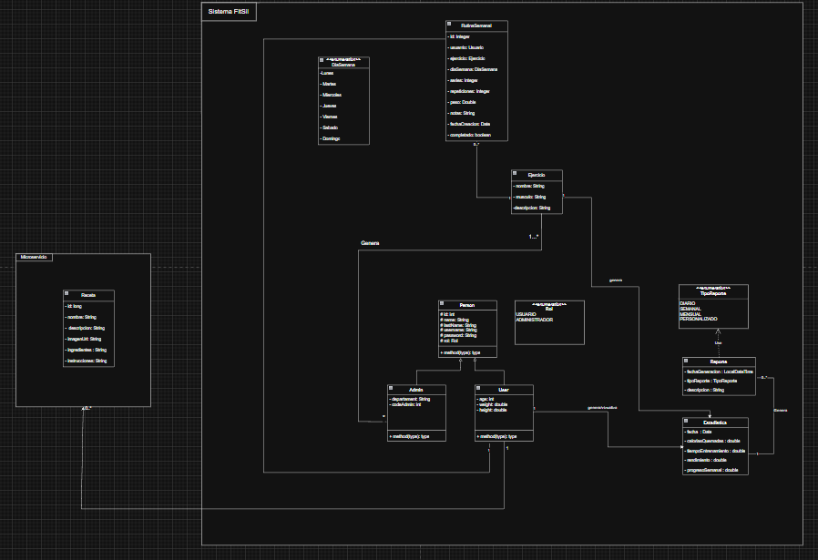

# Arquitectura del Sistema

## Introducción

Este capítulo describe la arquitectura del Sistema Fitness Multiplataforma utilizando el modelo C4 (Context, Container, Component, Code) para representar diferentes niveles de abstracción del sistema.

El modelo C4 permite visualizar la arquitectura desde cuatro perspectivas:

- **Nivel 1 - Context**: Vista general del sistema y sus usuarios
- **Nivel 2 - Container**: Contenedores principales y su comunicación
- **Nivel 3 - Component**: Componentes dentro de cada contenedor
- **Nivel 4 - Code**: Estructura detallada del código

## Modelo C4 - Nivel 1 (Context)

### Diagrama de Contexto

El diagrama de contexto muestra el sistema FitSIL desde una vista de alto nivel, identificando los actores principales y cómo interactúan con el sistema.

{#fig-context}

### Descripción del Contexto

**Actores del Sistema**:

- **Usuario/Administrador [Person]**: Persona que utiliza la aplicación FitSIL para gestionar sus rutinas de ejercicio, consultar recetas, visualizar estadísticas y recibir notificaciones. Puede tener rol de usuario regular o administrador con permisos adicionales.

**Sistema Principal**:

- **Sistema FitSIL [Software System]**: Plataforma multiplataforma que permite a los usuarios gestionar información sobre ejercicios, rutinas, recetas y reportes. Incluye funcionalidades para usuarios y administradores, con un gimnasio virtual integrado.

### Interacciones

El usuario/administrador utiliza la aplicación FitSIL a través de las interfaces móvil y web para:
- Gestionar rutinas de ejercicio personalizadas
- Consultar catálogo de ejercicios con instrucciones
- Buscar y filtrar recetas saludables
- Visualizar estadísticas y progreso personal
- Generar y consultar reportes
- Recibir notificaciones del sistema

## Modelo C4 - Nivel 2 (Container)

### Diagrama de Contenedores

El diagrama de contenedores descompone el sistema FitSIL en los principales bloques de construcción tecnológica y muestra cómo se comunican entre sí.

{#fig-container}

### Descripción de Contenedores

**Usuarios**:
- **Administrador**: Accede al sistema para gestión administrativa, creación de reportes y configuración general
- **Cliente (Usuario)**: Accede al sistema para consumir servicios, gestionar rutinas y consultar información personalizada

**Aplicaciones Cliente**:

1. **Aplicación Web**  
   - **Tecnología**: Angular  
   - **Descripción**: Aplicación web SPA (Single Page Application) que proporciona interfaz responsive para navegadores  
   - **Uso**: Acceso completo a funcionalidades desde navegador web  
   - **Puerto**: HTTPS (443) en producción

2. **Aplicación Móvil**  
   - **Tecnología**: React Native con Expo  
   - **Descripción**: Aplicación nativa/híbrida para dispositivos Android e iOS  
   - **Uso**: Acceso móvil a funcionalidades del sistema  
   - **Comunicación**: HTTP/JSON vía REST API

**Backend**:

3. **API/Backend [Spring Web]**  
   - **Tecnología**: Spring Boot 3.x con Spring Web  
   - **Descripción**: Servidor de aplicaciones que expone servicios REST para clientes web y móvil  
   - **Puerto**: 8081  
   - **Responsabilidades**:
     - Procesar lógica de negocio
     - Validar y transformar datos
     - Gestionar autenticación y autorización
     - Servir endpoints REST
   - **Módulos principales**:
     - Módulo Seguridad (Security)
     - Módulo Usuario (User)
     - Módulo Ejercicio (Exercise)
     - Módulo Rutina (Routine)
     - Módulo Receta (Recipe)
     - Módulo Estadísticas (Statistics)

**Almacenamiento de Datos**:

4. **Database [PostgreSQL]**  
   - **Tecnología**: PostgreSQL 15  
   - **Descripción**: Sistema de gestión de base de datos relacional que almacena toda la información persistente  
   - **Puerto**: 5432  
   - **Contenido**:
     - Usuarios y perfiles
     - Catálogo de ejercicios
     - Rutinas personalizadas
     - Recetas y nutrición
     - Estadísticas y métricas
     - Reportes generados
     - Notificaciones

5. **Database Web [MySQL]**  
   - **Tecnología**: MySQL  
   - **Descripción**: Base de datos alternativa para el frontend web (si aplica)  
   - **Uso**: Almacenamiento específico de datos del frontend web

**Microservicios de Reportes**:

6. **Microservicio de Reportes**  
   - **Tecnología**: Spring Boot (microservicio independiente)  
   - **Descripción**: Servicio especializado en generación y gestión de reportes  
   - **Funcionalidades**:
     - Generación de reportes en PDF, Excel, JSON
     - Reportes mensuales, semanales, de calorías
     - Reportes públicos y privados
     - Descarga de reportes históricos

### Flujo de Comunicación
```
Usuario → Aplicación Móvil → API/Backend → Database
                              ↓
                         Microservicio Reportes
```

1. Usuario interactúa con Aplicación Móvil
2. App Móvil envía peticiones HTTP/JSON a API/Backend
3. Backend procesa lógica y consulta/modifica Database
4. Para reportes, Backend delega al Microservicio de Reportes
5. Respuesta fluye de vuelta al usuario

## Modelo C4 - Nivel 3 (Component)

### Diagrama de Componentes

El diagrama de componentes detalla la estructura interna del contenedor Backend, mostrando los módulos principales y sus dependencias.

{#fig-component}

### Descripción de Componentes

**Capa de Presentación (Controllers)**:

1. **RoutesController**  
   - Expone endpoints REST para gestión de rutas  
   - Maneja peticiones HTTP relacionadas con navegación

2. **RoutesService**  
   - Implementa lógica de negocio para rutas  
   - Procesa y valida datos antes de persistir

**Capa de Backend (Spring Framework)**:

3. **AuthController**  
   - **Endpoints**: `/auth/login`, `/auth/register`  
   - **Responsabilidad**: Gestión de autenticación y registro

4. **Modulo Seguridad (Security)**  
   - Configuración de Spring Security  
   - Validación de JWT tokens  
   - Control de acceso basado en roles

5. **Modulo Usuario (User)**  
   - Gestión de perfiles de usuario  
   - Actualización de datos personales  
   - Cambio de contraseña

6. **Modulo Ejercicio (Exercise)**  
   - CRUD de ejercicios  
   - Búsqueda y filtrado  
   - Gestión de imágenes

7. **Modulo Rutina (Routine)**  
   - Gestión de rutinas por día  
   - Marcado de rutinas completadas  
   - Estadísticas de entrenamiento

8. **Modulo Estadisticas (Statistics)**  
   - Cálculo de métricas  
   - Dashboard de progreso  
   - Reportes de actividad

**Capa de Acceso a Datos (Repositories)**:

9. **JPARepository**  
   - Capa de persistencia con Spring Data JPA  
   - Operaciones CRUD automáticas  
   - Queries personalizadas

**Base de Datos**:

10. **Database Web (MySQL)**  
    - Almacena datos del sistema  
    - Gestión de transacciones  
    - Integridad referencial

## Modelo C4 - Nivel 4 (Code)

### Diagrama de Código

El diagrama de código muestra la estructura detallada de clases e interfaces en la aplicación móvil, siguiendo los principios de Clean Architecture.

{#fig-code}

### Descripción de la Estructura de Código

**Sistema FitSIL (Mobile App)**:

La aplicación móvil está organizada en paquetes siguiendo Clean Architecture:

#### **Paquete: IU (Interfaz de Usuario)**

**Subpaquete: fragments**
- `LoginFragment`
- `ListRoutine`
- `Ejercicio`
- `Rutinas`
- `Recetas`
- `Reportes`
- `Notificacione`

**Subpaquete: activities**
- `DI_Inject`: Inyección de dependencias
- `SplashActivity`: Pantalla inicial
- `LoginActivity`: Autenticación
- `MainActivity`: Actividad principal
- `MenuActivity`: Menú de navegación
- `AddRoutineActivity`: Agregar rutinas
- `ListRoutineActivity`: Listar rutinas
- `UpdateRoutineActivity`: Actualizar rutinas
- `DeleteRoutineActivity`: Eliminar rutinas
- `CompleteRoutineActivity`: Completar rutinas

#### **Paquete: domain (Dominio)**

**Entidades**:
- `DTO_ES_02`: Data Transfer Object para estadísticas
- `Usuario`: Entidad de usuario
- `Ejercicio`: Entidad de ejercicio
- `Rutina`: Entidad de rutina
- `Receta`: Entidad de receta
- `Estadistica`: Entidad de estadística
- `Reporte`: Entidad de reporte
- `Notificacion`: Entidad de notificación

**Use Cases (Casos de Uso)**:
- `nombreString`: Gestión de cadenas
- `descripcionString`: Gestión de descripciones

#### **Paquete: data (Datos)**

**Subpaquete: retrofit**
- `INTERFAZ_RUTAS_EJERCICIO`: Interface para endpoints de ejercicios
- Configuración de Retrofit para comunicación HTTP

**Subpaquete: repositories**
- `UsuarioRepository`: Repositorio de usuarios
- `EjercicioRepository`: Repositorio de ejercicios
- `RutinaRepository`: Repositorio de rutinas
- `RecetaRepository`: Repositorio de recetas
- `EstadisticaRepository`: Repositorio de estadísticas
- `ReporteRepository`: Repositorio de reportes
- `NotificacionRepository`: Repositorio de notificaciones

#### **Paquete: presentation (Presentación)**

**ViewModels**:
- Gestionan el estado de la UI
- Comunican Use Cases con Fragments/Activities

**Adapters**:
- Adaptadores para RecyclerViews
- Transformación de datos para visualización

**Utilities**:
- Clases auxiliares
- Helpers y utilidades comunes

### Relaciones y Flujo de Datos
```
Activities/Fragments (UI)
       ↓
ViewModels (Presentation)
       ↓
Use Cases (Domain)
       ↓
Repositories (Data)
       ↓
Retrofit API (Data)
       ↓
Backend REST API
```

**Flujo de una operación típica**:

1. Usuario interactúa con un `Fragment` o `Activity`
2. La UI delega al `ViewModel` correspondiente
3. El ViewModel ejecuta un `Use Case` del dominio
4. El Use Case utiliza un `Repository` para obtener/modificar datos
5. El Repository usa `Retrofit` para hacer peticiones HTTP
6. El backend procesa y responde
7. Los datos fluyen de vuelta actualizando la UI

## Principios de Arquitectura Aplicados

### Clean Architecture

La aplicación móvil sigue los principios de Clean Architecture:

1. **Independencia de Frameworks**: La lógica de negocio no depende de React Native o Expo
2. **Testabilidad**: Cada capa puede ser testeada independientemente
3. **Independencia de UI**: La lógica no está acoplada a componentes visuales
4. **Independencia de BD**: El dominio no conoce PostgreSQL o APIs
5. **Independencia de Agentes Externos**: El core no depende del backend

### SOLID Principles

- **S - Single Responsibility**: Cada clase tiene una única responsabilidad
- **O - Open/Closed**: Abierto para extensión, cerrado para modificación
- **L - Liskov Substitution**: Las implementaciones respetan los contratos
- **I - Interface Segregation**: Interfaces específicas para cada cliente
- **D - Dependency Inversion**: Dependencias apuntan hacia abstracciones

### Separation of Concerns

Cada capa tiene responsabilidades bien definidas:

- **Presentation**: Solo UI y eventos de usuario
- **Domain**: Solo lógica de negocio pura
- **Data**: Solo acceso a datos y comunicación
- **Core**: Solo utilidades y servicios compartidos

## Tecnologías por Capa

### Presentación
- React Native
- Expo Router
- React Context API
- TypeScript

### Dominio
- TypeScript (tipos e interfaces)
- Lógica de negocio pura

### Datos
- Axios para HTTP
- Expo SecureStore
- Mappers (DTO ↔ Entity)

### Core
- Axios (configurado)
- Event Bus
- Storage utilities

## Patrones de Diseño Implementados

### 1. Repository Pattern
Abstrae el origen de datos, permitiendo cambiar de API REST a GraphQL sin afectar el dominio.

### 2. Dependency Injection
Las dependencias se inyectan en constructores, facilitando testing y desacoplamiento.

### 3. Observer Pattern
Implementado en EventBus para comunicación entre componentes sin acoplamiento directo.

### 4. Singleton Pattern
ApiClient y SecureStorage son singletons para mantener estado global.

### 5. Factory Pattern
Creación de instancias de repositorios y use cases de forma centralizada.

### 6. Adapter Pattern
Mappers que convierten DTOs del backend a Entities del dominio.

## Seguridad en la Arquitectura

### Autenticación
- JWT tokens generados en backend
- Tokens almacenados en Expo SecureStore (encriptado)
- Validación automática en cada request

### Autorización
- Control de acceso basado en roles (USUARIO/ADMINISTRADOR)
- Endpoints protegidos en backend
- UI adapta según permisos del usuario

### Almacenamiento Seguro
- Contraseñas hasheadas con BCrypt en backend
- Tokens nunca en AsyncStorage
- Uso de Keychain (iOS) / KeyStore (Android)

### Comunicación
- HTTPS en producción
- Validación de certificados SSL
- Timeout de sesión configurable
- Interceptores para manejo de errores 401

## Escalabilidad

La arquitectura permite:

- ✅ Agregar nuevos módulos sin afectar existentes
- ✅ Cambiar tecnologías de capas externas sin tocar dominio
- ✅ Escalar backend horizontalmente (stateless)
- ✅ Implementar caché local sin modificar use cases
- ✅ Migrar a GraphQL cambiando solo Data Layer

## Conclusiones de Arquitectura

La arquitectura implementada en el Sistema Fitness Multiplataforma ofrece:

✅ **Separación clara de responsabilidades** mediante capas bien definidas  
✅ **Alta testabilidad** gracias a interfaces y dependency injection  
✅ **Mantenibilidad** facilitada por código organizado y tipado  
✅ **Escalabilidad** que permite crecer sin refactorizar el core  
✅ **Independencia de frameworks** en la lógica de negocio  
✅ **Seguridad robusta** con JWT y almacenamiento encriptado  
✅ **Rendimiento optimizado** mediante arquitectura stateless y caché  

El uso del modelo C4 permite entender el sistema desde múltiples perspectivas, desde el contexto general hasta los detalles de implementación del código.